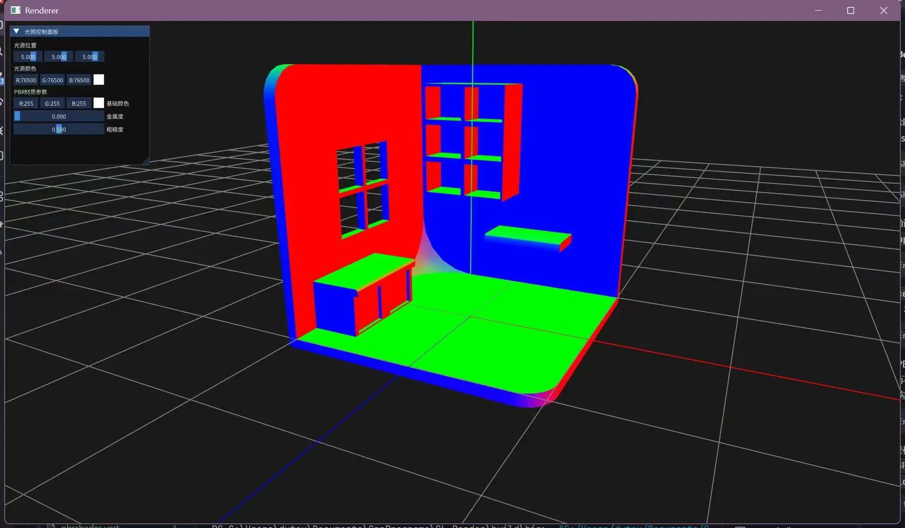
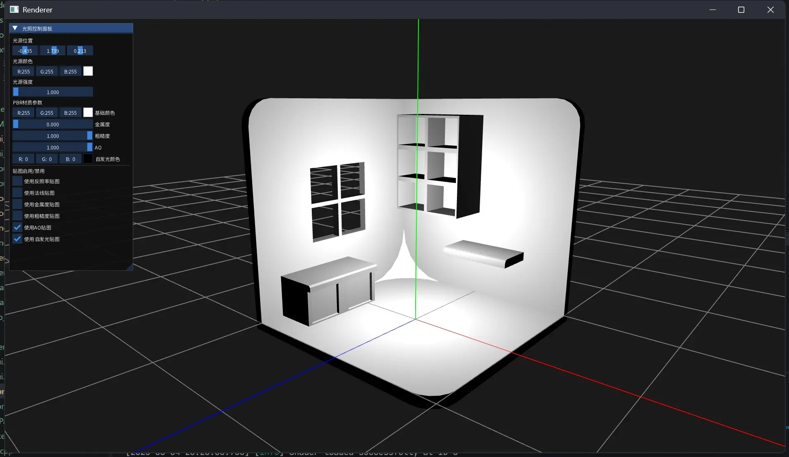

# GL_render
learn GL
这是一个早期学习写的OpenGL项目，集成了ImGUI，完成了光栅化。

包括：
1. 初始化
	1. 初始化GLUT
	2. 1080p分辨率
	3. 三重缓冲
	4. 帧数控制与垂直同步
2. 简单的用户输入
	1. WASD、EQ移动
	2. 鼠标转动视角
	3. ESC退出
3. 简单的渲染
	1. 包含一个球体生成
	2. 简单的兰伯特光照
	3. 单个光源
	4. 坐标系网格

内置了stb_iamge、spdlog
shader无法正常编译的话请替换为绝对路径

日志：
4.1

初始化
- 初始化GLUT
- 1080p分辨率

简单的用户输入
- WASD、EQ移动
- 鼠标转动视角

简单的渲染
- 包含一个球体生成
- 简单的兰伯特光照
- 单个光源

4.2
- 三重缓冲
- 帧数控制与垂直同步
- ESC退出
- 坐标系网格

4.4
- 加入ImGUI，适配中文
- 加入shader参数控制面板
- 现在按下"`"键可以调出鼠标
- 加入stb_image支持,可以截屏(BUG:截图纯黑)
